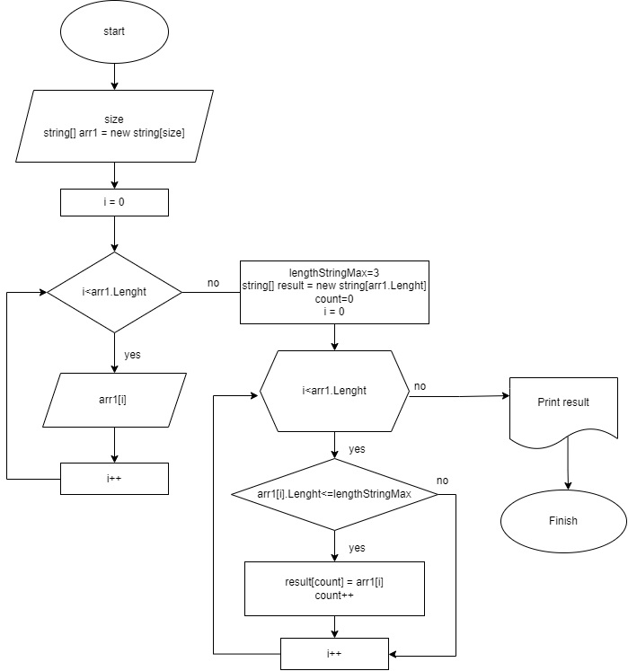

## Выполнила студентка Таборина Вераника Анатольевна

# **_Итоговая проверочная работа._** 
Эта работа требуется для проверки ваших знаний и навыков по итогу прохождения первого блока обучения на программе разработчик. Мы должны убедиться, что базовое знакомство с it прошло успешно.
Задача алгоритмически не самая сложная, однако для полноценного выполнения проверочной работы необходимо:
1.  Создать репозиторий на GitHub;
2.  Нарисовать блок-схему алгоритма (можно обойтись блок-схемой основной содержательной части, если вы выделяете ее в отдельный метод);
3.  Снабдить репозиторий оформленным текстовым описанием решения (файл README.md);
4.  Написать программу, решающую поставленную задачу;
5.  Использовать контроль версии в этой работе над этим небольшим проектом (не должно быть так что все залито одним коммитом, как минимум этапы 2, 3 и 4 должны быть расположены в разных коммитах);

## **_Задача:_**
 Написать программу, которая из массива строк формирует массив из строк, длина которых меньше либо равна 3 символа. Первоначальный массив можно ввести с помощью клавиатуры, либо задать на старте выполнения алгоритма. При решении не рекомендуется пользоваться коллекциями, лучше обойтись исключительно массивами.

**_Примеры:_**
["hello", "2", "world", ":-)"] -> ["2", ":-)"]  
["1234", "1567", "-2", "computer science"] -> ["-2"]  
["Russia", "Denmark", "Kazan"] -> []

 ## **_Блок-схема выполнения задачи._**

Решение.
1.	Пользователь задает размер массива
2.	Далее последовательно вводит элементы массива
3.  Получен строковый массив
4.	В результате работы программы получаем новый результирующий массив из строк, длинна которых меньше либо равна 3 символа.
5.	Полученный строковый массив выводится на экран

